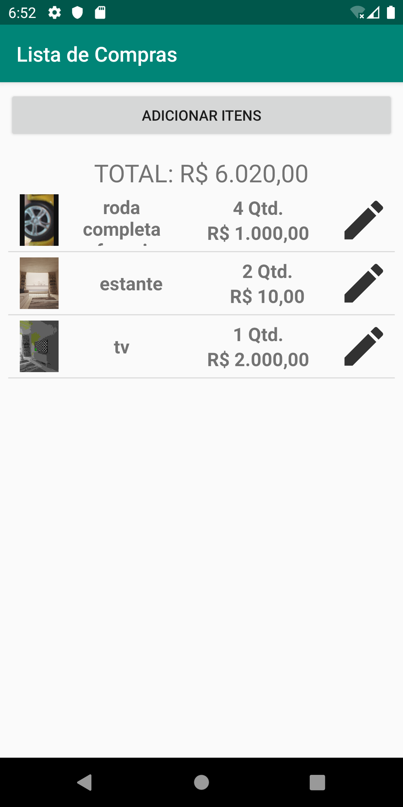
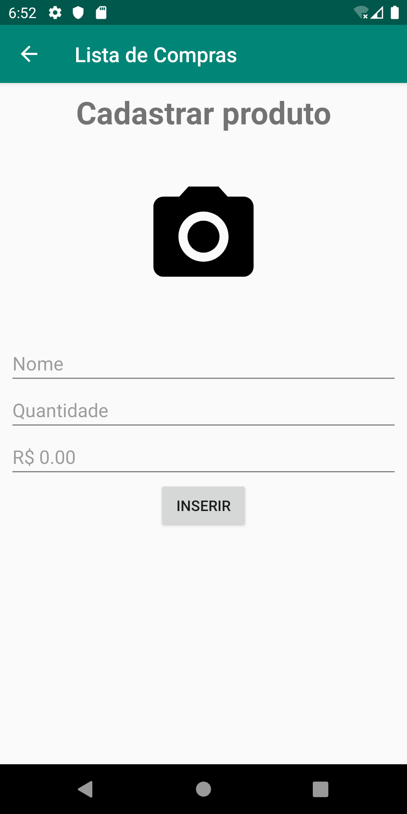

# Lista de Compras App
### Aplicativo para registrar itens para compra, ao abrir pela primeira vez é possível adicionar o item desejado com clique no adicionar itens.
### Ao clicar no adicionar itens, abre a tela para cadastrar o produto informando imagem (não obrigatório), nome, quantidade e valor. Após informar o desejado o registro é feito com clique no inserir.
### Ao clicar no INSERIR o item é registrado no banco interno do dispositivo, para ver a lista é necessário voltar para tela inicial.  

### Tela inicial com a lista 
 

### Tela para cadastrar o produto

### Gif de Teste

##### Obs.: Aplicativo para fins acadêmicos.
